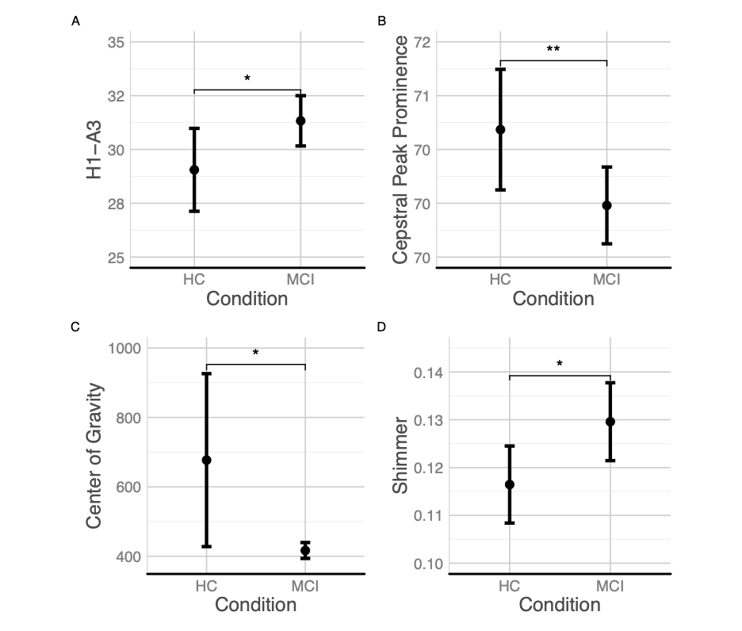

#  The acoustic profile of individuals with MCI
This repository contains the data and the statistics employed in the

Themistocleous Charalambos, Eckeström, Marie, Kokkinanis Dimitrios (2020). The acoustic profile of individuals with MCI. *PLOS ONE*. doi:XXXXXXX.

Mild Cognitive Impairment (MCI) is a syndrome characterized by cognitive decline greater than expected for an individual's age and education level. This study aims to determine whether voice quality and speech fluency distinguish patients with MCI from healthy individuals to improve diagnosis of patients with MCI. We analyzed recordings of the Cookie Theft picture description task produced by 26 patients with MCI and 29 healthy controls from Sweden and calculated measures of voice quality and speech fluency. The results show that patients with MCI differ significantly from HC with respect to acoustic aspects of voice quality, namely H1-A3, cepstral peak prominence, center of gravity, and shimmer; and speech fluency, namely articulation rate and averaged speaking time. The method proposed along with the obtainability of connected speech productions can enable quick and easy analysis of speech fluency and voice quality, providing accessible and objective diagnostic markers of patients with MCI.

# Main Results

Voice quality and phonation elicited from audio recordings produced by patients with MCI and HC. 

 Measures of speech fluency elicited from audio recordings produced by patients with MCI and HC. 

# Additional Scripts
Praat Scripts were employed in the acoustic analysis.
The acoustic analysis was conducted using [Praat][https://www.fon.hum.uva.nl/praat/]

